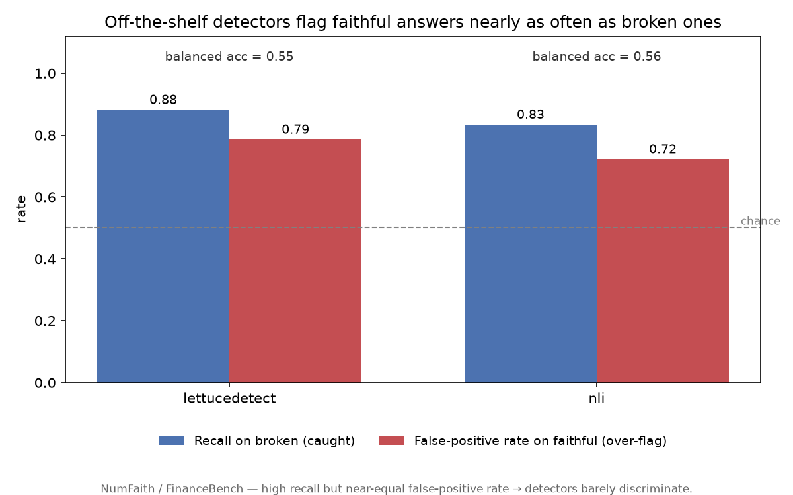

# NumFaith

**A numeric-faithfulness stress test for RAG hallucination detectors.**

## Finding

NumFaith takes correct, source-grounded answers from public financial QA (FinanceBench),
programmatically breaks them in controlled ways (swap a number, shift a date, flip a
direction word, …) so each broken answer is auto-labelled `unfaithful`, then measures
whether off-the-shelf faithfulness detectors catch the breaks. The headline result is a
**null one, and an instructive one**: on real financial QA, two popular detectors
(LettuceDetect and a DeBERTa-MNLI entailment baseline) **flag faithful answers almost as
often as broken ones** — ~72–79% false-positive rate on faithful answers and balanced
accuracy of only ~0.55 (chance is 0.50). There is **no meaningful gap** between numeric
edits and prose edits, nor between subtle and gross number changes. In other words, out of
the box these detectors are near-indiscriminate on this data and would reject most correct,
source-grounded answers. See [RESULTS.md](RESULTS.md) for the full analysis and limitations.

## Headline results

| detector | precision | recall | f1 | balanced_accuracy | faithful_fpr | recall_number_swap | recall_date_shift | recall_unit_currency | recall_direction_flip | recall_entity_swap | recall_subtle | recall_gross |
|---|---|---|---|---|---|---|---|---|---|---|---|---|
| lettucedetect | 0.780 | 0.882 | 0.828 | 0.548 | 0.786 | 0.887 | 0.922 | 0.925 | 0.800 | 0.800 | 0.893 | 0.880 |
| nli | 0.785 | 0.834 | 0.809 | 0.556 | 0.722 | 0.830 | 0.863 | 0.850 | 0.840 | 0.800 | 0.820 | 0.840 |

_LLM-judge: skipped (no API key). Table/figures regenerated by `make report`._



A second figure, [`results/figures/recall_by_type.png`](results/figures/recall_by_type.png),
shows that no perturbation type is caught much above the false-positive baseline.

## Reproduce

CPU is enough (a GPU only speeds up the transformer detectors).

```bash
python -m venv .venv && source .venv/bin/activate
make install
make all          # data → perturb → eval → report
```

- `make all` runs the full pipeline and writes `results/metrics.json`, the table
  (`results/tables/`), and the figures (`results/figures/`).
- **Runtime:** `data`/`perturb`/`report` take seconds; `make eval` is ~12–13 min on the
  first run (two local models + one-time Hugging Face downloads), then seconds on cache.
- The **LLM-judge** reference is skipped unless you `export OPENAI_API_KEY=…` first; it is
  then incremental (only the judge is recomputed). Run `make help` for all targets.

## How it works

1. **Load** — normalise FinanceBench into faithful `(source, question, answer)` trios
   (`numfaith/load.py`).
2. **Perturb** — break each answer with controlled, in-kind edits, auto-labelling them
   `unfaithful`; each edit passes a **safety check** (the replacement must be absent from
   the source) so labels are trustworthy without human annotation (`numfaith/perturb.py`,
   tested in `tests/test_perturb.py`).
3. **Detect** — run each faithfulness detector over the test set, caching raw outputs
   (`numfaith/detectors.py`, `numfaith/evaluate.py`).
4. **Report** — score precision/recall/F1/balanced-accuracy overall, by perturbation type,
   and subtle-vs-gross, plus the faithful false-positive rate (`numfaith/report.py`).

## Data & licence

- **Source data:** [FinanceBench](https://huggingface.co/datasets/PatronusAI/financebench)
  (Islam et al., 2023, [arXiv:2311.11944](https://arxiv.org/abs/2311.11944)), licensed
  **CC-BY-NC-4.0**. It is loaded from Hugging Face at build time and **not redistributed**;
  the derived `data/processed/*.jsonl` are gitignored.
- **Code:** MIT (see [LICENSE](LICENSE)).

## Citation

```bibtex
@misc{javed2026numfaith,
  author = {Baber Javed},
  title  = {NumFaith: A Numeric-Faithfulness Stress Test for RAG Hallucination Detectors},
  year   = {2026},
  howpublished = {\url{https://github.com/baberjaved/NumFaith}},
  note   = {arXiv ID TBD}
}
```
