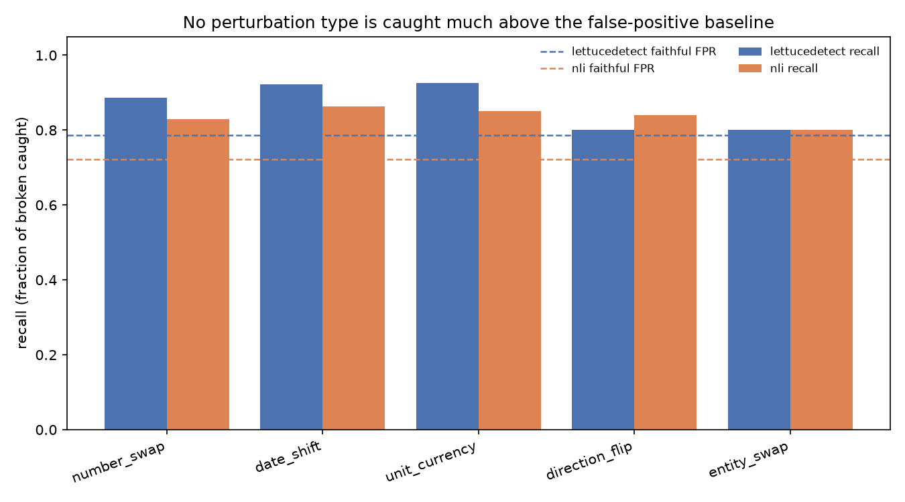

# NumFaith — Results

A numeric-faithfulness stress test for RAG hallucination detectors. This write-up
reports what we found, **including the unflattering parts** — the honesty is the point.

## TL;DR

On a controlled, auto-labelled test set built from real financial QA, two popular
off-the-shelf faithfulness detectors (LettuceDetect and a DeBERTa-MNLI entailment
baseline) **flag faithful answers almost as often as broken ones**. Balanced accuracy
sits around **0.55** (chance is 0.50), and there is **no meaningful gap** between
numeric edits and prose edits, nor between subtle and gross number changes. The headline
we set out to test ("detectors strong on prose miss numeric edits") **did not hold** with
this setup — a different, arguably more useful finding emerged: these detectors are
near-indiscriminate on real financial QA out of the box.

## Setup

- **Source:** [FinanceBench](https://huggingface.co/datasets/PatronusAI/financebench)
  (150 examples), normalised to faithful `(source, question, answer)` trios and filtered
  to answers containing a number or date → **126 trios**.
- **Perturbation engine:** five controlled, in-kind edits — `number_swap` (subtle &
  gross), `date_shift`, `unit_currency`, `direction_flip`, `entity_swap`. Every broken
  answer is **auto-labelled `unfaithful`** and passes a **safety check**: the replacement
  must not appear in the source (else the "broken" answer might still be supportable). The
  result is a **524-row** test set: 126 faithful originals + 398 labelled broken copies.
- **Detectors** (uniform `detect(source, question, answer) → verdict + unfaithfulness
  score`): **LettuceDetect** (pretrained ModernBERT span detector), **NLI** (DeBERTa-MNLI
  entailment baseline), and an **LLM-judge** reference. Positive class = `unfaithful`.
- The **LLM-judge was skipped** in this run (no `OPENAI_API_KEY`); its wrapper records a
  clean `skipped` and the rest of the suite runs unaffected.

## Results

| detector | precision | recall | f1 | balanced_accuracy | faithful_fpr | recall_number_swap | recall_date_shift | recall_unit_currency | recall_direction_flip | recall_entity_swap | recall_subtle | recall_gross |
|---|---|---|---|---|---|---|---|---|---|---|---|---|
| lettucedetect | 0.780 | 0.882 | 0.828 | 0.548 | 0.786 | 0.887 | 0.922 | 0.925 | 0.800 | 0.800 | 0.893 | 0.880 |
| nli | 0.785 | 0.834 | 0.809 | 0.556 | 0.722 | 0.830 | 0.863 | 0.850 | 0.840 | 0.800 | 0.820 | 0.840 |

_LLM-judge: skipped (no API key)._




**Reading the numbers:**

- **High recall, high false positives.** Both detectors catch most broken answers
  (recall 0.83–0.88) — but they also flag **72–79% of the *faithful* originals** as
  unfaithful. The result is balanced accuracy barely above chance.
- **No numeric-vs-prose gap.** Recall is roughly flat across all five perturbation types
  (~0.80–0.93). Numeric edits are not missed more than prose edits.
- **No subtle-vs-gross gap.** Subtle and gross number swaps are caught at essentially the
  same rate (LettuceDetect 0.893 vs 0.880; NLI 0.820 vs 0.840).
- In the per-type figure, every recall bar sits at or barely above each detector's
  false-positive baseline — i.e. no perturbation type is caught meaningfully better than
  the rate at which faithful answers are wrongly flagged.

## Interpretation

The detectors do not so much *detect hallucinations* here as *fire on almost everything*.
That is still a meaningful, checkable claim: **out of the box, these popular detectors are
not usable as faithfulness filters on real financial QA** — they would reject the majority
of correct, source-grounded answers.

The most important driver is the **grounding mismatch**: FinanceBench's human-written
"faithful" answers frequently include reasoning, arithmetic, and conclusions that are
*correct* but **not stated verbatim in the evidence passage** we feed as `source_text`. A
strict grounding detector flags those as unsupported — and is not entirely wrong to. Our
auto-labelling calls them faithful; the detectors disagree. This inflates the
false-positive rate and washes out any per-type signal.

## Limitations (read these)

1. **Grounding mismatch (central caveat).** `source_text` is the FinanceBench `evidence`
   only. Faithful answers reason beyond it, so the high faithful-FPR partly reflects our
   source construction, not purely detector failure. A fuller 10-K context or an
   extractive-only faithful subset would test this.
2. **NLI truncation.** The DeBERTa-MNLI baseline truncates long, tabular sources to 512
   tokens, which can cut the supporting figure out of view.
3. **No LLM-judge.** The expensive upper-reference was not run (no key). We do not yet know
   whether a strong LLM judge discriminates where these encoders do not.
4. **Single, small dataset.** 126 trios from one source (FinanceBench). Diagnostic, not
   definitive.
5. **Weak edits on small integers.** A few `number_swap` edits on small integers produce
   short replacements (e.g. `3`); they pass the standalone-absence safety check but are
   weaker "unfaithfulness" than large-magnitude swaps.
6. **Binary verdicts, not tuned thresholds.** We score each detector's native verdict. The
   cached unfaithfulness scores would allow threshold sweeps / ROC analysis that might
   recover some discrimination.

## Future work

- Run the **LLM-judge** reference (`export OPENAI_API_KEY=…; make eval`) — incremental
  thanks to caching — and compare it to the encoders.
- Build an **extractive-only faithful subset** (answer's key figure appears verbatim in
  source) to separate detector failure from grounding mismatch.
- Feed **fuller source context** (beyond the evidence snippet).
- Add **more datasets** (FinQA, TAT-QA) for breadth.
- **Threshold sweeps** from the cached scores.

## Reproduce

```bash
python -m venv .venv && source .venv/bin/activate
make install
make all      # data → perturb → eval → report
```

See the [README](README.md) for details, data licences, and citation.
